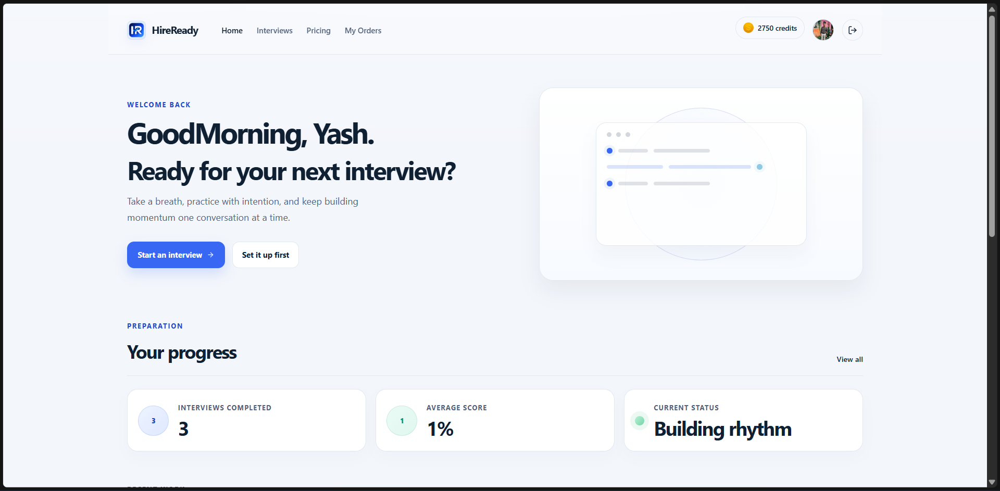
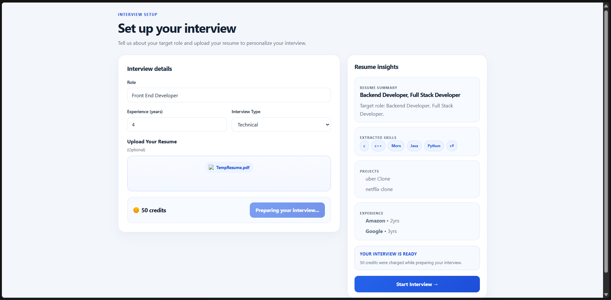
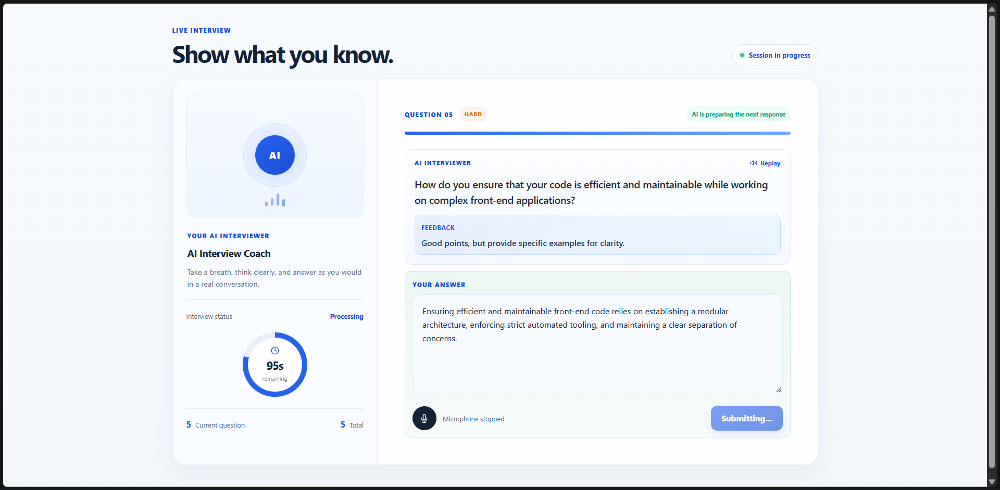
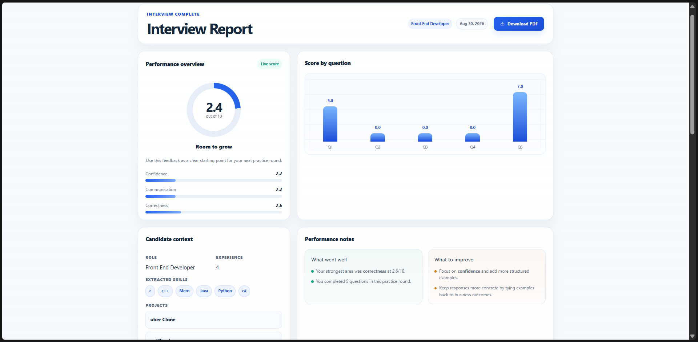

# HireReady

HireReady is a full-stack mock interview practice platform. Users sign in with Google, configure a role-specific interview (optionally from a PDF resume), complete a timed AI-guided session, and review saved, question-level feedback.

## Table of Contents

- [Key Features](#key-features)
- [Screenshots and Demo](#screenshots-and-demo)
- [Tech Stack](#tech-stack)
- [Application Workflow](#application-workflow)
- [Project Architecture](#project-architecture)
- [Installation and Local Setup](#installation-and-local-setup)
- [Environment Variables](#environment-variables)
- [Usage](#usage)
- [API Overview](#api-overview)
- [Deployment](#deployment)
- [Future Improvements](#future-improvements)
- [Contributing](#contributing)
- [License](#license)

## Key Features

- Google sign-in through Firebase Authentication, with a server-issued HTTP-only session cookie.
- A dashboard that restores the signed-in session, shows available credits, and displays recent interviews.
- Interview setup for a target role, years of experience, and one of three modes: technical, HR, or managerial.
- Optional PDF resume upload (up to 5 MB); the server extracts its text and uses OpenRouter to identify the role, skills, projects, and experience entries.
- AI-generated five-question interview rounds personalized with the entered details and available resume context.
- Credit-based interview preparation: a new account starts with 100 credits and preparing an interview costs 50 credits.
- A timed live interview UI with text answers, browser text-to-speech for questions and feedback, and browser speech recognition when supported.
- Per-answer AI evaluation for confidence, communication, correctness, score, and concise feedback.
- Saved interview reports with overall and category averages, question-by-question answers, scores, and feedback; reports can be printed using the browser print dialog.
- Searchable, filterable, paginated interview history and payment/order history.
- Razorpay checkout and server-side payment-signature verification for credit purchases.

## Screenshots and Demo

### Dashboard



### Interview Setup



### Live Interview



### Interview Report



<!-- Add a deployed-demo link here when available. -->

## Tech Stack

| Area | Implementation |
| --- | --- |
| Frontend | React 19, Vite 8, React Router, Redux Toolkit, Axios |
| UI | CSS, Tailwind CSS Vite plugin, Framer Motion, React Icons |
| Backend | Node.js, Express 5 |
| Database | MongoDB with Mongoose |
| Authentication | Firebase Authentication (Google popup) and JWT stored in an HTTP-only cookie |
| AI | OpenRouter Chat Completions API using `openai/gpt-4o-mini` |
| Resume processing | Multer, `pdfjs-dist` |
| Payments | Razorpay Checkout and Razorpay Node SDK |
| Browser capabilities | Web Speech API (`speechSynthesis` and `SpeechRecognition`/`webkitSpeechRecognition`) |

## Application Workflow

1. The user signs in with Google from `/Auth`.
2. Firebase returns the Google profile; the client sends its name, email, and image to the API, which creates or finds the user and sets a seven-day JWT cookie.
3. From the dashboard, the user opens interview setup and enters a role, experience, and interview type. A PDF resume is optional.
4. If provided, the API extracts PDF text and asks the AI service to return structured role, skills, projects, and experience data. The setup screen displays those results.
5. Starting the round deducts 50 credits, creates an interview record, and returns exactly five generated questions with progressive difficulty and time limits.
6. The live interview presents each question. The candidate can type an answer or use supported browser voice recognition; questions and returned feedback can be spoken aloud by the browser.
7. Each submitted answer is evaluated by the AI service. On the final answer, the server calculates averages, marks the interview complete, and returns the report.
8. The report and history pages retrieve the saved results. Users can also purchase credits through Razorpay and view their payment history.

## Project Architecture

```text
HireReady/
|-- client/                     # React/Vite single-page application
|   |-- src/pages/              # Dashboard, auth, history, report, pricing, orders
|   |-- src/components/         # Setup, live interview, and report UI
|   |-- src/redux/              # Client-side authenticated user state
|   `-- src/utils/firebase.js   # Firebase Google Auth initialization
`-- server/                     # Express API
    |-- routes/                 # Auth, user, interview, and payment endpoints
    |-- controllers/            # Request handlers and interview/payment logic
    |-- models/                 # User, Interview, and Payment Mongoose models
    |-- services/               # OpenRouter and Razorpay integrations
    |-- middlewares/            # JWT-cookie auth and Multer upload handling
    `-- config/                 # MongoDB connection and JWT creation
```

The client calls the Express API with credentials enabled. The API persists users, interviews, and payments in MongoDB; it calls OpenRouter for resume extraction, question generation, and answer evaluation. Uploaded PDF files are written temporarily to `server/public` and deleted after processing.

## Installation and Local Setup

### Prerequisites

- Node.js and npm
- A MongoDB database URI
- A Firebase project with Google sign-in enabled
- An OpenRouter API key
- Razorpay test or live credentials if testing payments

### 1. Install dependencies

Open two terminals from the repository root:

```bash
cd server
npm install
```

```bash
cd client
npm install
```

### 2. Configure environment files

Create `server/.env` and `client/.env` using the variables in [Environment Variables](#environment-variables). Do not commit either file.

### 3. Start the API

```bash
cd server
npm run dev
```

The API defaults to port `6000` when `PORT` is not set.

### 4. Start the client

```bash
cd client
npm run dev
```

Vite serves the client at the URL it prints (normally `http://localhost:5173`).

### Important current local-development limitation

The client currently hardcodes its API base URL in `client/src/App.jsx` to `https://hireready-dbzk.onrender.com`; it does not read an API URL from a Vite environment variable. The server CORS configuration, however, allows `http://localhost:5173`.

To run the client against a local API, the current implementation requires manually changing that constant to `http://localhost:6000`. This README does not make that source-code change. Also note that the server currently creates the authentication cookie with `secure: true` and `sameSite: 'none'`, so HTTP local authentication may require an HTTPS development setup or a development-specific cookie configuration.

### Build the client

```bash
cd client
npm run build
```

The generated files are written to `client/dist/`. A client preview is available with `npm run preview`.

## Environment Variables

Create the following files locally. Placeholder values below are intentionally non-secret.

`server/.env`

```env
PORT=6000
MONGODB_URI=mongodb+srv://<username>:<password>@<cluster>/<database>?retryWrites=true&w=majority
JWT_SECRET_KEY=replace_with_a_long_random_secret
OPENROUTERAPI_KEY=replace_with_your_openrouter_api_key
RAZORPAY_KEY_ID=rzp_test_replace_with_your_key_id
RAZORPAY_KEY_SECRET=replace_with_your_razorpay_key_secret
```

`client/.env`

```env
VITE_FIREBASE_APIKEY=replace_with_your_firebase_web_api_key
```

Only `VITE_FIREBASE_APIKEY` is read from the client environment in the current code. The remaining Firebase web configuration values are presently embedded in `client/src/utils/firebase.js`.

## Usage

1. Open the app and select **Continue with Google**.
2. On the dashboard, choose **Start an interview**.
3. Enter the role, years of experience, and interview type. Optionally upload a PDF resume and prepare the interview.
4. After the short preparation countdown, start the interview. Ensure you have at least 50 credits.
5. Listen to or read each question, then type an answer or use the microphone button in a supported browser. Submit before the visible timer expires.
6. After the fifth response, review the report for overall score, category averages, question scores, submitted answers, and AI feedback.
7. Return later through **Interviews** to open completed reports. Use **Pricing** to purchase credits and **My Orders** to review payments.

## API Overview

All routes are served by the Express API. Routes marked as authenticated require the JWT cookie set after Google sign-in.

| Method | Endpoint | Auth | Purpose |
| --- | --- | --- | --- |
| `POST` | `/api/auth/google` | No | Create/find a user from Google profile data and set the session cookie. |
| `GET` | `/api/auth/logout` | No | Clear the session cookie. |
| `GET` | `/api/user/currentuser` | Yes | Return the current user. |
| `POST` | `/api/interview/resume` | Yes | Upload `resume` as multipart form data, extract PDF text, and return AI-extracted resume context. |
| `POST` | `/api/interview/generatequestion` | Yes | Deduct credits, save an interview, and generate five questions. |
| `POST` | `/api/interview/submitanswer` | Yes | Save and evaluate one answer. |
| `POST` | `/api/interview/finish` | Yes | Complete the interview and return its calculated report. |
| `GET` | `/api/interview/get-interview` | Yes | List the current user’s interviews. |
| `GET` | `/api/interview/report/:id` | Yes | Fetch one saved interview report. |
| `POST` | `/api/payment/create-order` | Yes | Create a Razorpay order for a supported plan. |
| `POST` | `/api/payment/verify` | Yes | Verify a Razorpay payment and add credits. |
| `POST` | `/api/payment/failed` | Yes | Mark an unpaid order as failed. |
| `GET` | `/api/payment/history` | Yes | List the current user’s payments. |

## Deployment

The client currently points to `https://hireready-dbzk.onrender.com`, which indicates a deployed Render API. No deployment manifest, Docker configuration, or frontend hosting configuration is included in the repository, so no further deployment workflow is documented here.

For a deployment, configure the server environment variables above, use HTTPS for the cross-site secure cookie, and set the Express CORS origin to the deployed client origin. Build the Vite client with `npm run build` and serve the generated `client/dist` through the chosen static host.

## Future Improvements

The following are not implemented in the current repository:

- Configurable client API base URL through a Vite environment variable.
- A local-development cookie/CORS configuration that works without HTTPS.
- Automated tests and continuous integration.
- A checked-in deployment configuration.
- Native report-file generation; the current **Download PDF** control opens the browser print dialog.
- Server-side validation of a Firebase ID token before accepting Google profile data.

## Contributing

Contributions are welcome. Please fork the repository, create a focused branch, make and test your changes, then open a pull request describing the change and any setup implications.

## License

No license file is currently included in this repository. Add a license before distributing or reusing the project under specific terms.
